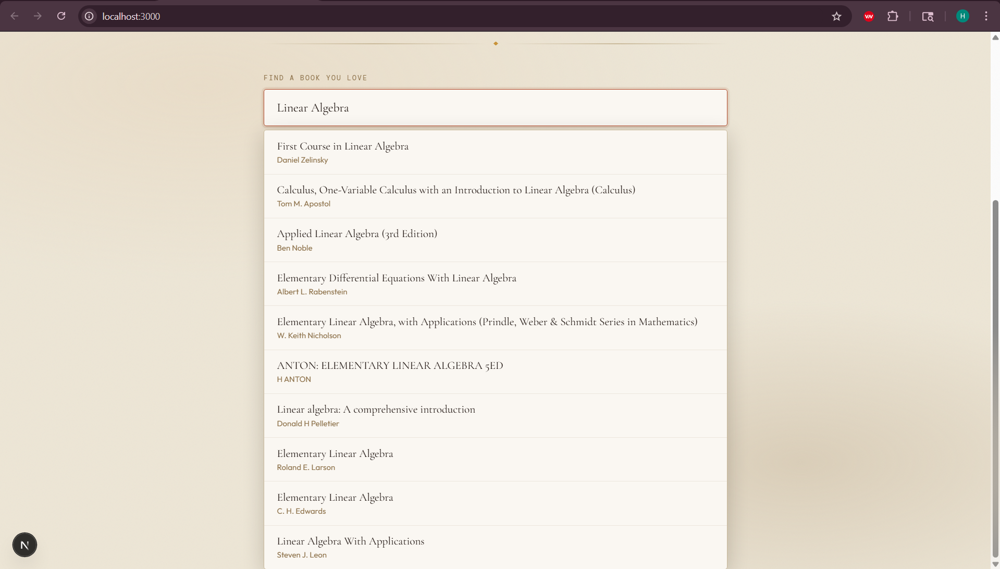
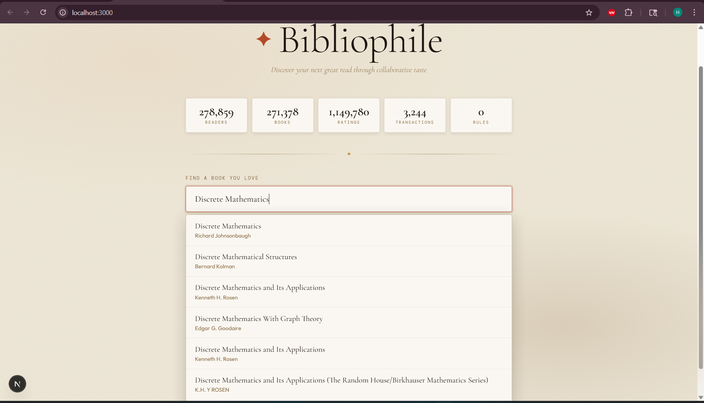
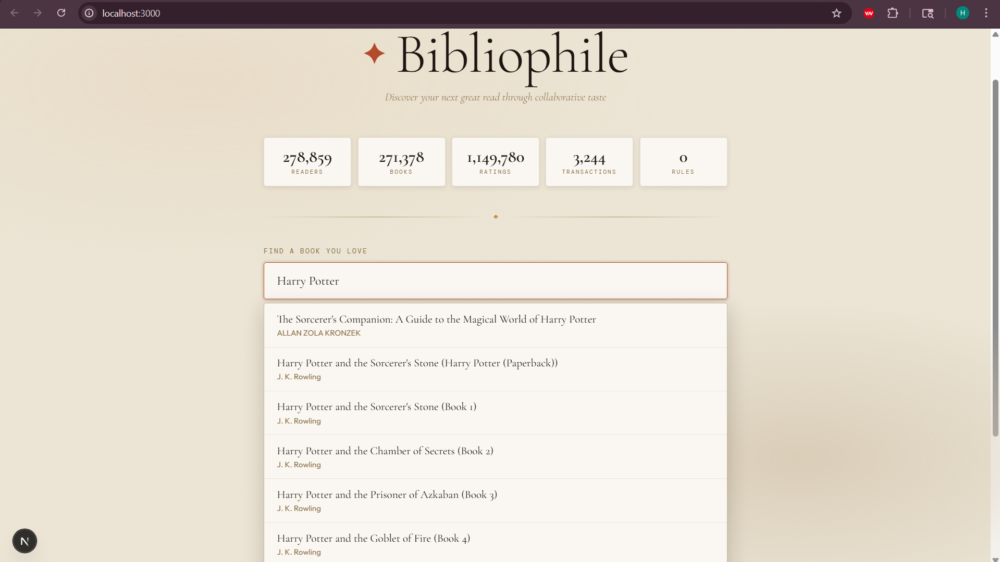

# Book Recommendation System

A full-stack web application that provides intelligent book recommendations using association rule mining. Built with FastAPI backend and Next.js frontend, this system analyzes user ratings and leverages the Apriori algorithm to suggest books users might enjoy.

## 📸 Screenshots






## 🎯 Features

- **Smart Recommendations**: Uses association rule mining to find books frequently bought/rated together
- **Book Search**: Search for books by title, author, or ISBN
- **System Statistics**: View dataset statistics including total books, users, and ratings
- **Responsive UI**: Modern, user-friendly interface built with React and Tailwind CSS
- **RESTful API**: Clean and documented API endpoints
- **Real-time Rule Building**: Rebuild recommendation rules on demand

## 🛠️ Tech Stack

### Backend
- **Framework**: FastAPI 0.135.2
- **Server**: Uvicorn
- **Data Processing**: Pandas 3.0.1
- **ML Algorithm**: MLxtend 0.24.0 (Apriori & Association Rules)
- **Python**: 3.x

### Frontend
- **Framework**: Next.js 16.2.1
- **UI**: React 19.2.4 with TypeScript
- **Styling**: Tailwind CSS 4
- **Icons**: Lucide React
- **HTTP Client**: Axios
- **Linting**: ESLint

## 📋 Prerequisites

- Python 3.8+ (for backend)
- Node.js 18+ (for frontend)
- npm or yarn (for frontend package management)
- Git

## 🚀 Installation & Setup

### Backend Setup

1. Navigate to the backend directory:
```bash
cd backend
```

2. Create a virtual environment:
```bash
python -m venv venv
```

3. Activate the virtual environment:

**Windows (PowerShell):**
```powershell
.\venv\Scripts\Activate.ps1
```

**Windows (CMD):**
```cmd
venv\Scripts\activate.bat
```

**macOS/Linux:**
```bash
source venv/bin/activate
```

4. Install dependencies:
```bash
pip install -r requirements.txt
```

### Frontend Setup

1. Navigate to the frontend directory:
```bash
cd frontend
```

2. Install dependencies:
```bash
npm install
```

## ▶️ Running the Application

### Start Backend Server

From the `backend` directory:
```bash
uvicorn app.main:app --reload
```

The API will be available at: `http://localhost:8000`
- API Documentation: `http://localhost:8000/docs` (Swagger UI)
- ReDoc: `http://localhost:8000/redoc`

### Start Frontend Development Server

From the `frontend` directory:
```bash
npm run dev
```

The application will be available at: `http://localhost:3000`

## 📁 Project Structure

```
book-recommendation-system/
├── backend/
│   ├── app/
│   │   ├── __init__.py           # Package initialization
│   │   ├── main.py               # FastAPI application and routes
│   │   ├── recommender.py        # Core recommendation engine
│   │   ├── schemas.py            # Pydantic data models
│   │   └── config.py             # Configuration settings
│   ├── data/
│   │   ├── Books.csv             # Book dataset
│   │   ├── Users.csv             # User dataset
│   │   └── Ratings.csv           # User ratings
│   └── requirements.txt           # Python dependencies
├── frontend/
│   ├── app/
│   │   ├── layout.tsx            # Root layout
│   │   ├── page.tsx              # Home page
│   │   └── globals.css           # Global styles
│   ├── components/
│   │   ├── SearchBox.tsx         # Book search component
│   │   ├── Recommendations.tsx   # Recommendations display
│   │   └── Stats.tsx             # Statistics component
│   ├── lib/
│   │   └── api.ts                # API client utilities
│   └── package.json              # Node dependencies
└── README.md
```

## 🔌 API Endpoints

### Health Check
```
GET /health
```
Returns the server status.

### Get Statistics
```
GET /stats
```
Returns system statistics including:
- Total number of books
- Total number of users
- Total number of ratings

**Response:**
```json
{
  "total_books": 271360,
  "total_users": 278858,
  "total_ratings": 1149780
}
```

### Search Books
```
GET /books/search?q={query}&limit={limit}
```
Search for books by title, author, or ISBN.

**Parameters:**
- `q` (string, required): Search query
- `limit` (integer, optional): Maximum results to return (default: 10)

**Response:**
```json
[
  {
    "isbn": "0195153448",
    "title": "Classical Mythology",
    "author": "Stephen Fry",
    "year": 2002
  }
]
```

### Get Recommendations
```
POST /recommend
```
Get book recommendations based on a search query.

**Request Body:**
```json
{
  "query": "Stephen King",
  "top_n": 5
}
```

**Parameters:**
- `query` (string): Book title, author, or ISBN to find related books
- `top_n` (integer): Number of recommendations to return

**Response:**
```json
[
  {
    "isbn": "0345404475",
    "title": "The Shining",
    "author": "Stephen King",
    "year": 1977,
    "confidence": 0.85
  }
]
```

### Rebuild Rules
```
POST /rebuild
```
Rebuild the association rules from the dataset. Useful after updating data.

## 🧠 How It Works

### Recommendation Algorithm

The system uses **Association Rule Mining** to generate recommendations:

1. **Data Load**: Loads Books, Users, and Ratings data from CSV files
2. **Transaction Creation**: Converts user ratings into transactions (books rated highly by the same user)
3. **Frequent Itemset Mining**: Uses the **Apriori algorithm** to find frequently co-purchased/co-rated books
4. **Association Rules**: Generates rules in the form: "If user liked Book A, they might like Book B"
5. **Ranking**: Rules are ranked by confidence (likelihood of recommendation)

### Configuration

Edit `backend/app/config.py` to adjust algorithm parameters:

- `MIN_POSITIVE_RATING`: Minimum rating threshold (default: 7)
- `MIN_SUPPORT`: Minimum support for frequent itemsets (default: 0.001)
- `MIN_CONFIDENCE`: Minimum confidence for rules (default: 0.3)
- `MIN_BOOK_FREQUENCY`: Minimum times a book must appear (default: 50)
- `MIN_USER_BOOKS`: Minimum books per user (default: 2)
- `MAX_POPULAR_BOOKS`: Maximum popular books to consider (default: 500)

## 🔧 Development

### Backend Testing

To test API endpoints:

```bash
# Using curl
curl -X GET "http://localhost:8000/stats"

# Or use the interactive Swagger UI at http://localhost:8000/docs
```

### Frontend Build

For production build:
```bash
npm run build
npm run start
```

## 📊 Data Format

### Books.csv
- ISBN: ISBN identifier
- Book-Title: Title of the book
- Book-Author: Author name
- Year-Of-Publication: Publication year
- Publisher: Publisher name

### Users.csv
- User-ID: Unique user identifier
- Location: User location
- Age: User age

### Ratings.csv
- User-ID: User identifier
- ISBN: Book ISBN
- Book-Rating: Rating given (0-10 scale)

## 🐛 Troubleshooting

**Backend won't start:**
- Ensure Python virtual environment is activated
- Check that all dependencies are installed: `pip install -r requirements.txt`
- Verify port 8000 is not in use

**Frontend won't connect to backend:**
- Ensure backend is running on `http://localhost:8000`
- Check CORS settings in `backend/app/main.py`
- Verify frontend is running on `http://localhost:3000`

**No recommendations found:**
- Check that data files (CSV) are present in `backend/data/`
- Review and rebuild rules via the `/rebuild` endpoint
- Adjust min confidence/support settings in `config.py`

## 📝 License

This project is open source and available for educational purposes.

## 👤 Author

Created as a semester 6 project.

---

**Happy reading with smart recommendations! 📚**
